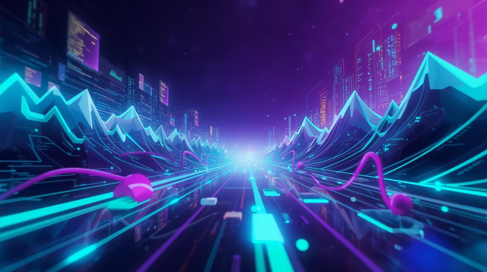
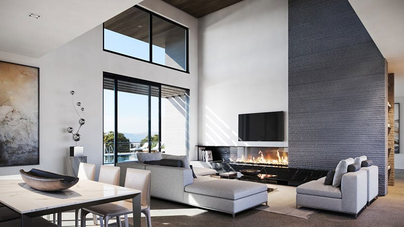
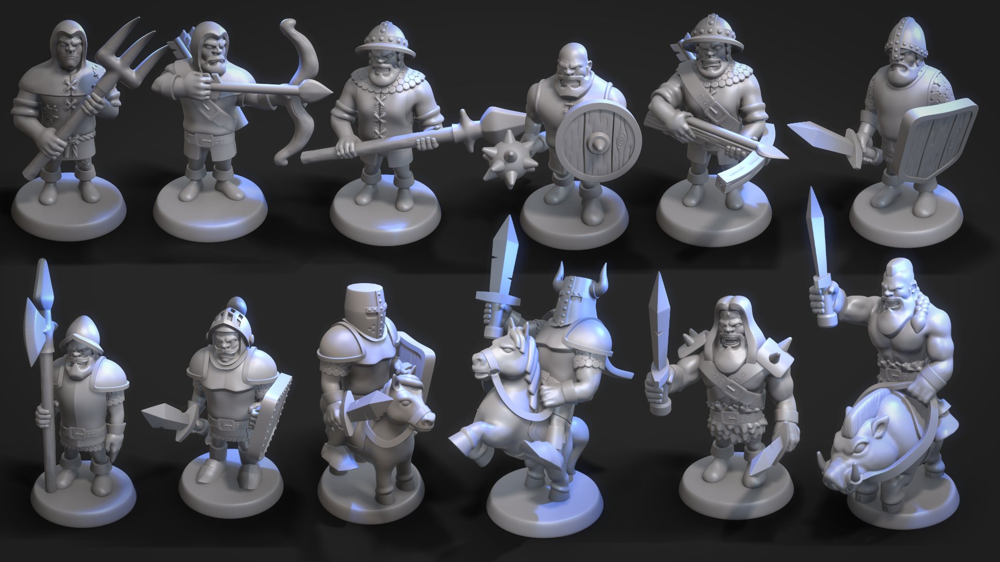
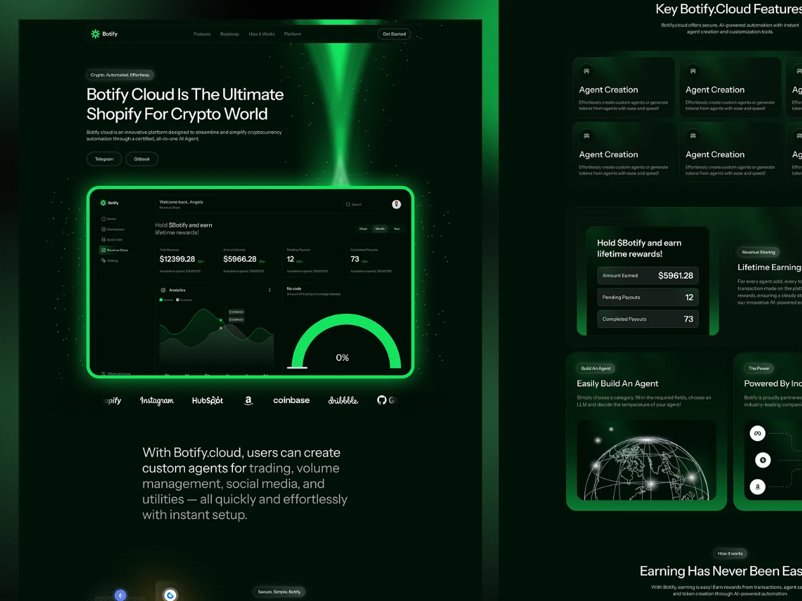

  

<h1 align="center">Hi, I'm Devstar 👋</h1>
<h3 align="center">Full-Stack Web • Game • Mobile Developer</h3>

   
  
  
   
  🚀 Building real-world applications  
  🎮 Creating games & interactive experiences  
  📱 Developing modern web & mobile solutions

---

## 👨‍💻 About Me
I'm a **Full-Stack Web, Game, and Mobile Developer** focused on creating
clean, scalable, and user-friendly applications.  
I enjoy turning ideas into working products and continuously improving my skills.

🎯 **Currently looking for a Developer Job opportunity**

---

## 🧠 Tech Stack
### 🌐 Web Development
- HTML, CSS, JavaScript
- React
- Node.js
- REST APIs

### 📱 Mobile Development
- Android / Cross-platform fundamentals
- UI-focused app development

### 🎮 Game Development
- Unity
- C#
- Game mechanics & logic

### 🛠 Tools & Workflow
- Git & GitHub
- VS Code
- Clean code & structured projects

---

## 🚀 Featured Projects
(These are the types of projects pinned on my profile)

### 🔹 Full-Stack Web Application
- User authentication
- Backend APIs
- Responsive UI
- Real-world use case

### 🔹 Unity Game Project
- Player movement & mechanics
- Game loop & scoring
- Optimized gameplay

### 🔹 Mobile Application
- Clean UI
- Practical features
- Performance-focused design

---

  

---

## 📫 Connect With Me
- GitHub: https://github.com/Devstar000

---

⭐ *Always learning. Always building.*
